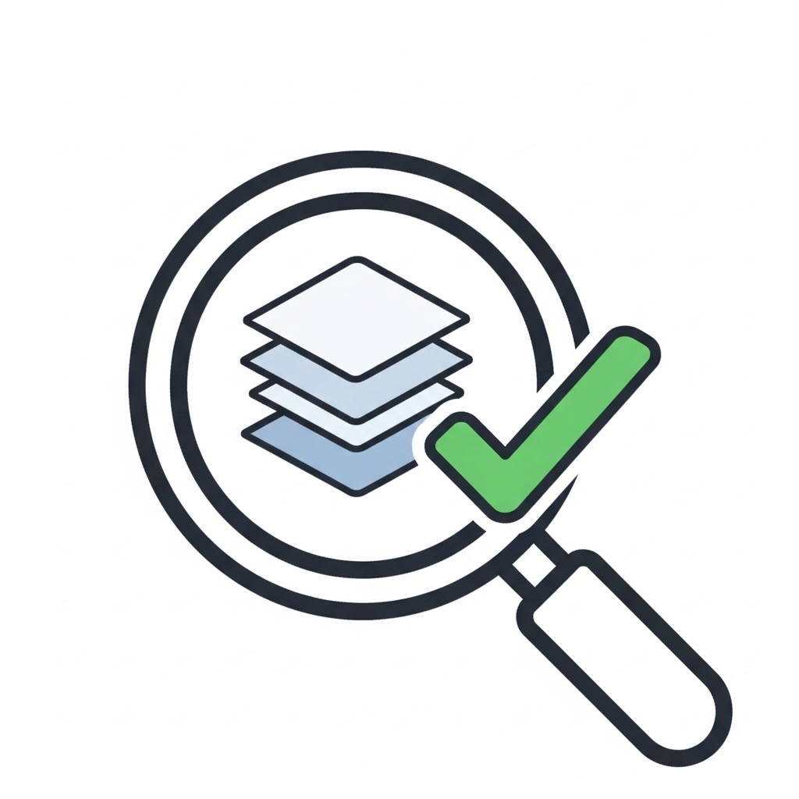

# Plugin Limpeza e Validação Inteligente para QGIS (ValidaGeo)

Um plugin para QGIS que automatiza a detecção e correção de problemas comuns em dados vetoriais, ajudando a garantir a qualidade e a integridade dos dados espaciais.

## Funcionalidades Principais

Este plugin oferece um conjunto completo de ferramentas para diagnosticar e corrigir sua camada vetorial com apenas alguns cliques.

### 🔎 Detecção de Erros
* **Geometrias Inválidas:** Encontra feições com problemas de geometria (ex: polígonos auto-intersectados, buracos incorretos, etc.).
* **Sobreposições:** Detecta polígonos dentro da mesma camada que se sobrepõem uns aos outros.
* **Duplicatas:** Identifica feições que possuem geometrias exatamente idênticas.

### ✨ Correção Automatizada
* **Correção de Geometria:** Utiliza o algoritmo `makeValid()` para corrigir automaticamente os problemas de geometria.
* **Correção de Sobreposição:** Une (dissolve) feições sobrepostas em uma única feição contínua.
* **Correção de Duplicatas:** Remove as feições duplicadas, mantendo apenas a original.
* **Criação Segura:** As correções são sempre aplicadas em uma **nova camada**, preservando seus dados originais. O nome da nova camada descreve quais correções foram aplicadas (ex: `sua_camada_corrigida_geom_sobrep`).

###  interactive Diagnóstico Interativo
* Os erros encontrados são listados em uma tabela detalhada.
* Ao clicar em qualquer erro na tabela, o mapa do QGIS automaticamente dá **zoom e seleciona a feição problemática**, permitindo uma inspeção visual imediata.

## Como Usar

1.  Instale o plugin através do Gerenciador de Complementos do QGIS.
2.  Abra o painel do plugin através do menu `Complementos > Limpeza e Validação Inteligente` ou pelo ícone na barra de ferramentas.
3.  Selecione a camada vetorial que deseja analisar na lista "Camada Alvo".
4.  Marque as caixas de seleção correspondentes aos testes que deseja realizar.
5.  Clique em **"Validar Camada Selecionada"**.
6.  Analise os resultados na tabela e clique nas linhas para inspecionar os erros no mapa.
7.  Para corrigir, clique no botão **"Corrigir Erros"**. Uma nova camada corrigida será criada e adicionada ao seu projeto.

## Reportando Bugs

Se encontrar algum problema ou tiver alguma sugestão, por favor, abra uma "Issue" aqui neste repositório do GitHub.
